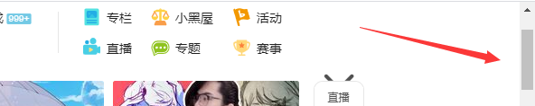
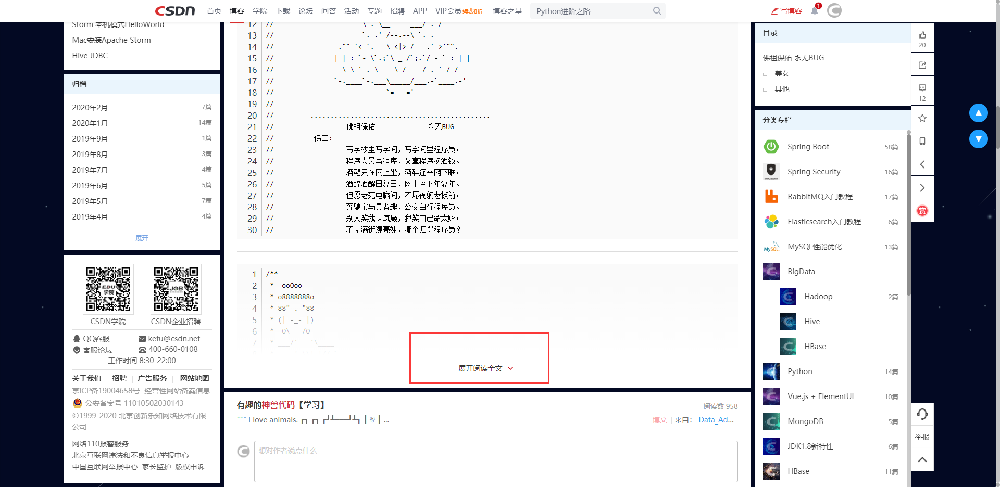
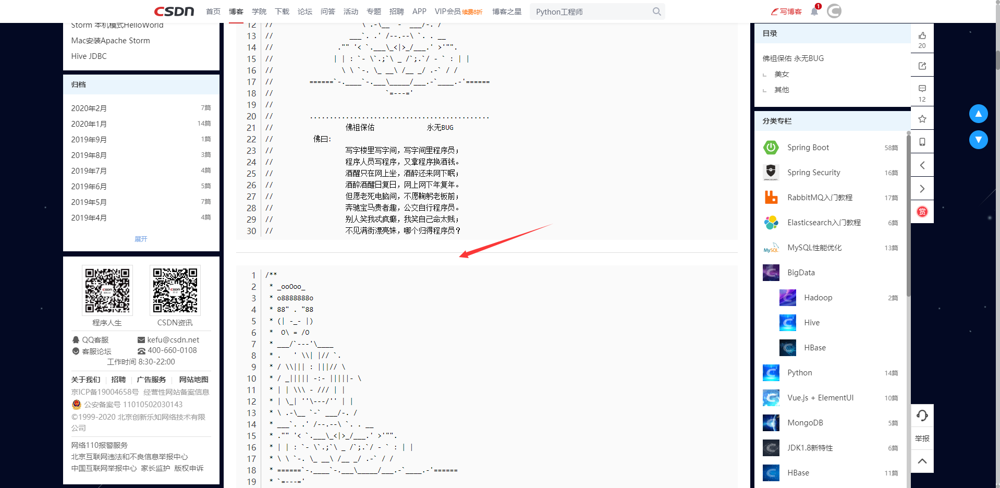

# TampermonkeyScripts

一些自己写油猴脚本

## [Z_Scrollbar_Style](./scripts/Z_Scrollbar_Style.user.js)

更改WebKit内核浏览器滚动条样式

[点击安装](https://ghproxy.com/https://raw.githubusercontent.com/1635685665/TampermonkeyScripts/master/scripts/Z_Scrollbar_Style.user.js)

使用之前：

使用之后：

## [Z_To_Top-Bottom](./scripts/Z_To_Top-Bottom.user.js)

在右侧添加两个按钮，方便一键跳转到网页顶部/底部

[点击安装](https://ghproxy.com/https://raw.githubusercontent.com/1635685665/TampermonkeyScripts/master/scripts/Z_To_Top-Bottom.user.js)

使用之前：

使用之后：

## [Z_Auto_Open](./scripts/Z_Auto_Open.user.js)

自动展开阅读全部

现在匹配的页面还比较少，准备慢慢添加

[点击安装](https://ghproxy.com/https://raw.githubusercontent.com/1635685665/TampermonkeyScripts/master/scripts/Z_Auto_Open.user.js)

使用之前：

使用之后：

## [Z_Net_Disk_Share_Code_Auto_Input](./scripts/Z_Net_Disk_Share_Code_Auto_Input.user.js)

自动填写网盘分享码

[点击安装](https://ghproxy.com/https://raw.githubusercontent.com/1635685665/TampermonkeyScripts/master/scripts/Z_Net_Disk_Share_Code_Auto_Input.user.js)

现在只有百度网盘。。。

## [Z_Pandownload_Link](./scripts/Z_Pandownload_Link.user.js)

添加百度网盘分享文件快速跳转到Pandownload解析下载的按钮

[点击安装](https://ghproxy.com/https://raw.githubusercontent.com/1635685665/TampermonkeyScripts/master/scripts/Z_Pandownload_Link.user.js)

## [Z_Baidu_Style](./scripts/Z_Baidu_Style.user.js)

美化百度页面

- 调整样式。
- 移除广告。

[点击安装](https://ghproxy.com/https://raw.githubusercontent.com/1635685665/TampermonkeyScripts/master/scripts/Z_Baidu_Style.user.js)

使用之前：

使用之后：

## [Z_Bilibili_Tool](./scripts/Z_Bilibili_Tool.user.js)

哔哩哔哩的辅助工具。

- 自动宽屏播放。
- 调整视频默认2.5倍速播放。
- 自动调整视频窗口位置。
- 关闭弹幕。

[点击安装](https://ghproxy.com/https://raw.githubusercontent.com/1635685665/TampermonkeyScripts/master/scripts/Z_Bilibili_Tool.user.js)

## [Z_HOW2J.CN_Tool](./scripts/Z_HOW2J.CN_Tool.user.js)

HOW2J.CN的辅助工具。

- 调整视频默认2.5倍速播放。
- 自动调整视频窗口位置。
- 自动展开折叠代码。
- 显示隐藏的内容。

[点击安装](https://ghproxy.com/https://raw.githubusercontent.com/1635685665/TampermonkeyScripts/master/scripts/Z_HOW2J.CN_Tool.user.js)
